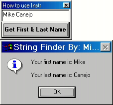



## How to use VB's InStr with a String

### Description

This example I put together teaches you how to use the InStr function with a string. InStr is very important to use because you can get certain information from a String by using it. Example: say a String has your first and last name in it like "Mike Canejo". InStr allows you to get just the last name or first name. First and Last name are just an example. You could do tons of things with Instr. This is very important for a beginner to know trust me. You'll be surprized if you end up using it in your next vb project :)
 
### More Info
 
String

A part of the string after a character specified

             |
---                |---
**Submitted On**   |2000-04-03 20:07:28
**By**             |[Michael L\. Canejo](https://github.com/Planet-Source-Code/PSCIndex/blob/master/ByAuthor/michael-l-canejo.md)
**Level**          |Beginner
**User Rating**    |4.3 (26 globes from 6 users)
**Compatibility**  |VB 4\.0 \(32\-bit\), VB 5\.0, VB 6\.0
**Category**       |[String Manipulation](https://github.com/Planet-Source-Code/PSCIndex/blob/master/ByCategory/string-manipulation__1-5.md)
**World**          |[Visual Basic](https://github.com/Planet-Source-Code/PSCIndex/blob/master/ByWorld/visual-basic.md)
**Archive File**   |[CODE\_UPLOAD4501432000\.zip](https://github.com/Planet-Source-Code/michael-l-canejo-how-to-use-vb-s-instr-with-a-string__1-6991/archive/master.zip)

